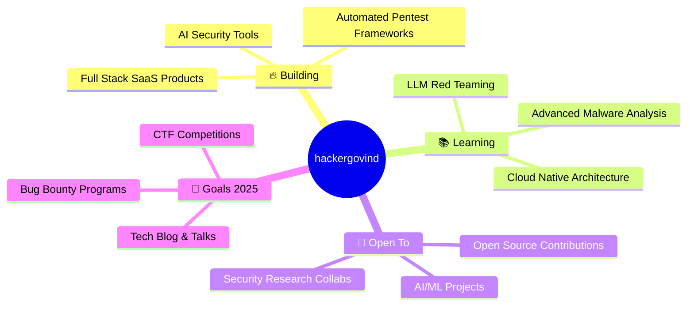

<div align="center">

<!-- ANIMATED HEADER -->


<!-- ANIMATED TYPING -->
<a href="https://git.io/typing-svg">
  
</a>

<br/>

<!-- PROFILE VIEWS & FOLLOWERS -->

&nbsp;
<a href="https://github.com/hackergovind?tab=followers">
  
</a>
&nbsp;
<a href="https://github.com/hackergovind?tab=repositories">
  
</a>

</div>

<!-- ANIMATED DIVIDER -->


##  &nbsp;About Me

```python
#!/usr/bin/env python3
class HackerGovind:
    """A Digital Craftsman & Cyber Sentinel"""
    
    def __init__(self):
        self.name = "Govind"
        self.handle = "@hackergovind"
        self.roles = [
            "🔥 Full Stack Developer",
            "🧠 AI/ML Engineer", 
            "🛡️ Cybersecurity Specialist",
            "⚙️ System Administrator",
        ]
        self.languages = ["Python", "JavaScript", "TypeScript", "Nim", "Bash", "SQL", "Go"]
        self.motto = "Break it. Fix it. Automate it. Deploy it. 🚀"
    
    def current_focus(self):
        return {
            "🔬 Learning": "Advanced LLM Fine-tuning & Red Teaming",
            "🛠️ Building": "AI-Powered Security Tools",
            "📚 Reading": "OWASP Top 10 & MITRE ATT&CK",
            "🎯 Goal": "Making the digital world safer, one commit at a time"
        }
    
    def say_hi(self):
        print("Thanks for dropping by! Let's build something legendary together! 🤝")

me = HackerGovind()
me.say_hi()
```


## 🛠️ Tech Arsenal

<div align="center">

### 🐍 Languages & Runtime
<p>


</p>

### 🌐 Full Stack Development
<p>


</p>

### 🧠 AI / ML / Data Science
<p>


</p>

### 🛡️ Cybersecurity & Pentesting
<p>


</p>

### ⚙️ System Administration & DevOps
<p>


</p>

### 🗄️ Databases & Cloud
<p>


</p>

### 🔧 Tools & Misc
<p>


</p>

</div>


## 📊 GitHub Metrics

<!-- Generated by lowlighter/metrics - https://github.com/lowlighter/metrics -->
<div align="center">
  
  <br/><br/>
  
  <table>
    <tr>
      <td>
        
      </td>
      <td>
        
      </td>
    </tr>
  </table>
  
  
  <br/><br/>
  
  <br/><br/>
  
</div>


## 📈 GitHub Stats

<div align="center">
  
  &nbsp;
  
</div>

<br/>

<div align="center">
  
</div>

<br/>

<div align="center">
  
</div>


## 🏆 GitHub Trophies

<div align="center">
  
</div>


## 🐍 Contribution Snake

<div align="center">
  <picture>
    <source media="(prefers-color-scheme: dark)" srcset="https://raw.githubusercontent.com/hackergovind/hackergovind/output/github-snake-dark.svg" />
    <source media="(prefers-color-scheme: light)" srcset="https://raw.githubusercontent.com/hackergovind/hackergovind/output/github-snake.svg" />
    
  </picture>
</div>


## 💻 Domains of Expertise

<div align="center">

```
╔══════════════════════════════════════════════════════════════════╗
║                                                                  ║
║   🔥 FULL STACK DEVELOPMENT                                     ║
║   ├── Frontend: React, Next.js, HTML5, CSS3, TailwindCSS        ║
║   ├── Backend: Node.js, Express, Django, FastAPI, Flask          ║
║   ├── Database: MongoDB, PostgreSQL, MySQL, Redis, Firebase      ║
║   └── APIs: REST, GraphQL, WebSockets, gRPC                     ║
║                                                                  ║
║   🧠 ARTIFICIAL INTELLIGENCE & MACHINE LEARNING                 ║
║   ├── Deep Learning: TensorFlow, PyTorch, Keras                  ║
║   ├── NLP: HuggingFace Transformers, LangChain, Ollama          ║
║   ├── Computer Vision: OpenCV, YOLO, MediaPipe                   ║
║   └── Data Science: NumPy, Pandas, Matplotlib, Jupyter           ║
║                                                                  ║
║   🛡️ CYBERSECURITY & PENTESTING                                 ║
║   ├── Offensive: Metasploit, Burp Suite, SQLMap, Nmap            ║
║   ├── Forensics: Wireshark, Volatility, Autopsy                  ║
║   ├── Reverse Eng: Ghidra, IDA Pro, Radare2                      ║
║   └── Standards: OWASP, MITRE ATT&CK, NIST, CVE                 ║
║                                                                  ║
║   ⚙️ SYSTEM ADMINISTRATION & DEVOPS                             ║
║   ├── OS: Linux (Arch, Ubuntu, Kali), Windows Server             ║
║   ├── Containers: Docker, Kubernetes, Podman                     ║
║   ├── IaC: Terraform, Ansible, CloudFormation                    ║
║   ├── CI/CD: Jenkins, GitHub Actions, GitLab CI                  ║
║   └── Monitoring: Prometheus, Grafana, ELK Stack                 ║
║                                                                  ║
║   🐍 PYTHON ECOSYSTEM                                            ║
║   ├── Web: Django, Flask, FastAPI, Streamlit                     ║
║   ├── Automation: Selenium, BeautifulSoup, Scrapy                ║
║   ├── Security: Scapy, Impacket, Pwntools                       ║
║   └── DevTools: Poetry, Pytest, Black, Mypy                     ║
║                                                                  ║
║   🟢 NODE.JS ECOSYSTEM                                           ║
║   ├── Frameworks: Express, Nest.js, Fastify                     ║
║   ├── Frontend: React, Next.js, Vite                              ║
║   ├── Realtime: Socket.io, WebRTC                                ║
║   └── Tools: npm, pnpm, ESLint, Prettier                        ║
║                                                                  ║
║   👑 NIM LANGUAGE                                                 ║
║   ├── Systems Programming & Low-Level Control                    ║
║   ├── High Performance Network Tools                             ║
║   ├── Cross-compilation & Metaprogramming                        ║
║   └── Security Tool Development                                  ║
║                                                                  ║
╚══════════════════════════════════════════════════════════════════╝
```

</div>


## 🎯 Current Focus

<div align="center">



</div>


## 📫 Connect With Me

<div align="center">
<a href="https://github.com/hackergovind">
  
</a>
&nbsp;
<a href="mailto:hackergovind@proton.me">
  
</a>
&nbsp;
<a href="https://linkedin.com/in/hackergovind">
  
</a>
&nbsp;
<a href="https://twitter.com/hackergovind">
  
</a>
</div>

<br/>

<div align="center">
  
</div>

<br/>

<!-- ANIMATED FOOTER -->

